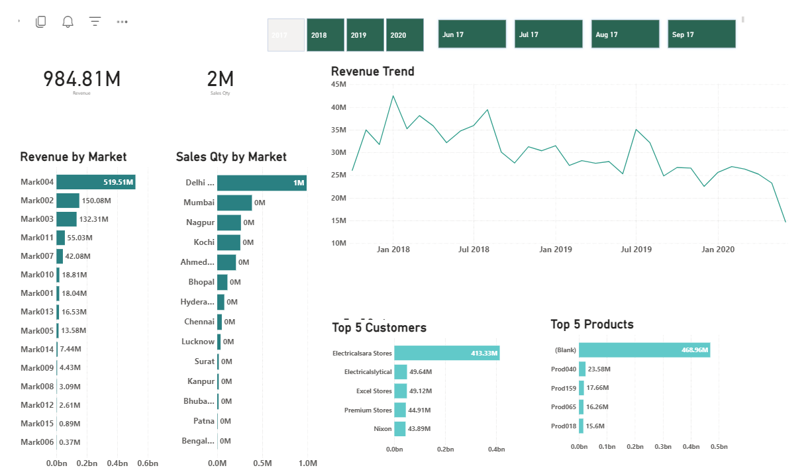
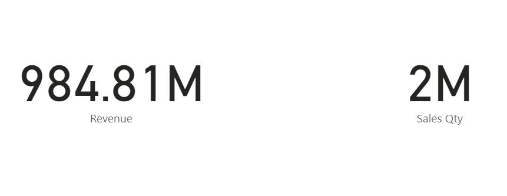
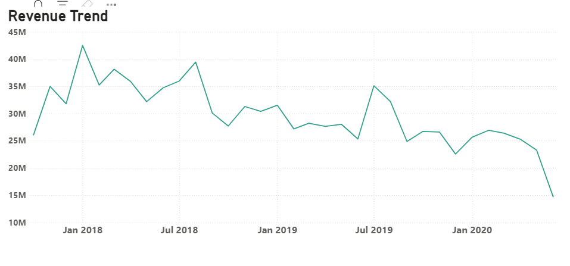
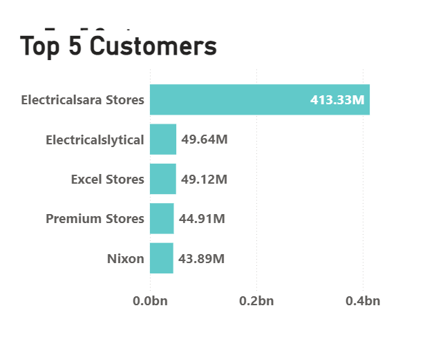
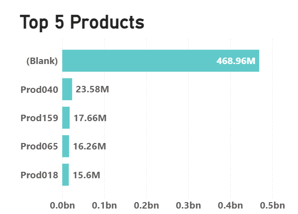
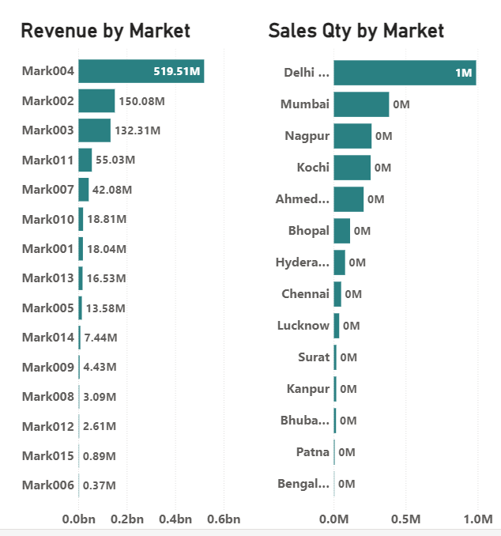

### README for Sales Data Analysis Project

---

# Sales Data Analysis for AtliQ Hardware Company

## Overview

This project presents a comprehensive Sales Data Analysis for AtliQ Hardware Company. Utilizing PowerBI for data visualization, along with MySQL and Excel for data management and preparation, we transformed raw data into insightful and actionable dashboards and reports. The analysis provides key insights into sales performance through various dimensions including total revenue, total quantity, yearly trends, top products, top customers, and revenue distribution by market and products.

### Key Insights

- Total Revenue: Comprehensive view of total sales revenue over the analyzed period.
- Total Quantity: Analysis of the total quantity of products sold.
- Yearly Trends: Visualization of sales trends year-over-year.
- Top 5 Products: Identification of the top 5 best-selling products.
- Top 5 Customers: Insights into the top 5 customers by revenue.
- Revenue by Market: Breakdown of revenue distribution across different markets.
- Revenue by Products: Detailed analysis of revenue generated by individual products.

## Tools and Technologies

- PowerBI: For creating interactive and insightful data visualizations.
- MySQL: Used for managing and querying the sales data.
- Excel: Assisted in data preparation and initial analysis.

## Dashboard Link

[PowerBI Dashboard](https://app.powerbi.com/groups/me/reports/01cfe5a3-960c-4c3e-8545-d0f14d3fdefe?ctid=50d602bb-46bc-4d6a-94df-e19b8ef16364&pbi_source=linkShare)

### DashBoard

## Screenshots

### Total Revenue and Total Quantity

### Yearly Sales Trends

### Top 5 Products

### Top 5 Customers

### Revenue by Market

## How to Use

1. Clone the repository:
      git clone https://github.com/yourusername/AtliQ-Hardware-Sales-Analysis.git
   
2. Open the project: Navigate to the project directory.
      cd AtliQ-Hardware-Sales-Analysis
   
3. Explore the analysis: Open the PowerBI dashboard link to explore the visualizations and insights.

## Contact

For any inquiries or further information, please contact me at:
- Email: patanshabeera3244@gmail.com
- LinkedIn: [LinkedIn Profile](www.linkedin.com/in/shabeerapatan)

---

Feel free to customize the content with your actual data and images, and replace placeholders with your personal information. If you need specific images for the results, please upload them here or provide links to them.
